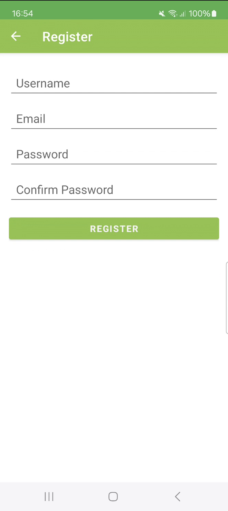
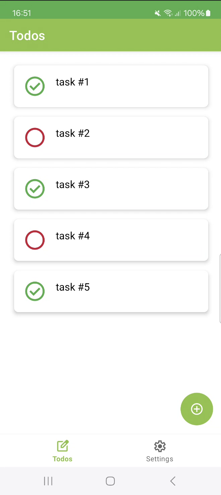
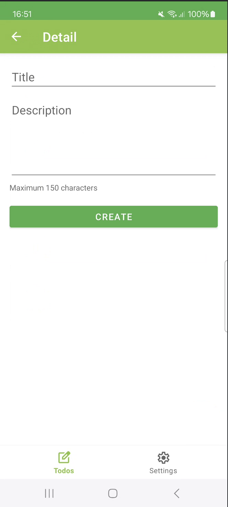
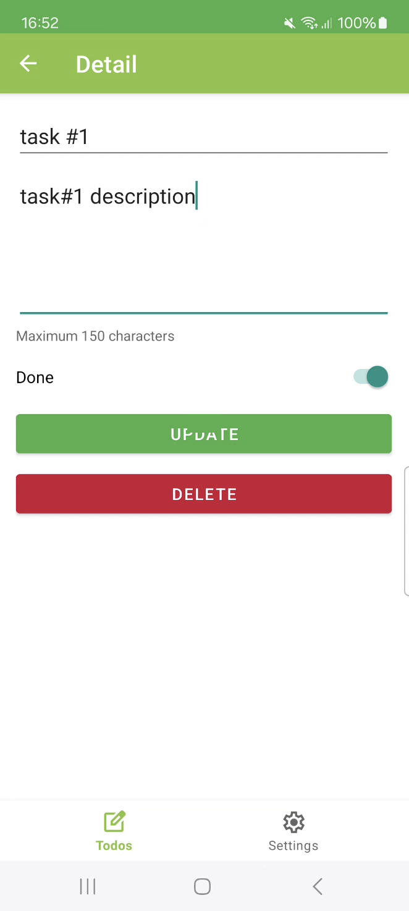
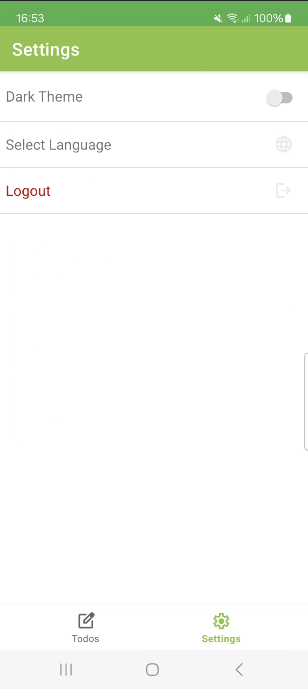
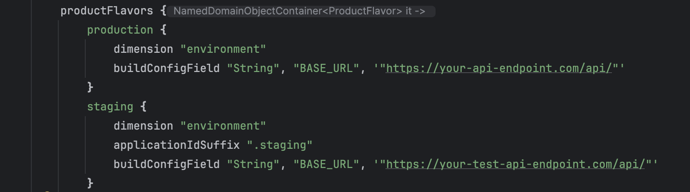

# Android Todos

# **Description:**

`Android Todos is an Android app developed for educational purposes` to practice with the Android platform.  
The purpose of the application is to organize your tasks by keeping track of them and marking completed tasks.

> **NOTE:** This application relies on a Backend API which you can find here: [Todos Backend API](https://github.com/FlavioVizza/ws-node-todos)

# **Features:**

- **Login**: Access your todo list using email and password
- **Register** a new account: create a new account specifying username, email, and password

- Through the **todo list page**, users can view their list of todo items

- Through the **todo detail page**, users can:
    - **Create Todo** items: Add new tasks to the todo list with title and description.
    - **Update Todo** items: Modify the status, title, and description of a to-do item through the detail page
    - **Delete Todo** items: Delete an existing Todos item through the detail page

- Through the **settings page**, users can:
    - Choose the **UI theme**: Choose between light or dark theme
    - Change **language** (currently available only in English and Italian)
    - **Log out**

    
    
    
    
    
    

# Technologies Used:

- **Kotlin**: Programming Language
- **Kotlin Coroutines**: Asynchronous Programming.
- **AndroidX**: Libraries for Android development.
- **MVVM**: Architecture with `LiveData` for reactive UI updates.
- **Hilt**: Dependency Injection framework.
- **Retrofit & OkHttp**: For network requests and API integration.
- **Navigation Component**: For managing app navigation.
- **XML Layouts & ViewBinding**: For defining and accessing UI elements.

# System Requirements:
- Android devices with Android 12 or later
- Optimized for Android 14 devices

# Installation:
1. Clone the repository to your local machine.
2. Open the project in Android Studio.
3. Add the base URL of the Todos API in the build.gradle file under productFlavors.
4. Run the application on an Android simulator or device. 🚀

Thank you for your interest in the Android Todos app! 😎